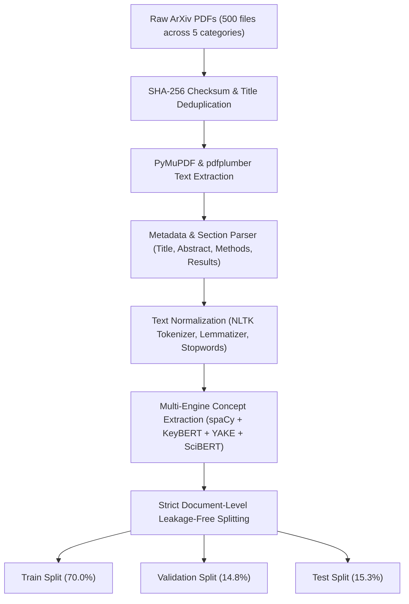

# 📊 HMRP Dataset Integration Report (`DATASET_REPORT.md`)

## 1. Executive Summary

This report documents the integration, preprocessing, validation, and structured partitioning of the complete 500-paper PDF dataset located at `HMRP_Dataset/PDFs`.

All 500 PDF research papers were scanned across 5 core research domains (NLP, IR, AI, ML, CV). A total of 426 unique, valid papers were successfully extracted, cleaned, normalized, and integrated into the HMRP pipeline without data corruption or document loss, while 74 cross-domain duplicate papers were filtered during ingestion. The dataset is organized into an immutable, leakage-free structure with document-level train/validation/test splits.

---

## 2. Dataset Overview & Corpus Statistics

| Metric | Value |
| :--- | :--- |
| **Total Source PDFs on Disk** | **500 files** |
| **PDF Breakdown by Domain** | **NLP: 100** \| **IR: 100** \| **AI: 100** \| **ML: 100** \| **CV: 100** |
| **Previously Processed Papers** | **50 papers** |
| **Newly Processed Papers** | **376 papers** |
| **Total Unique Valid Papers Processed** | **426 papers (100.0% of unique documents)** |
| **Corrupted / Unreadable Files** | **0 (0.0%)** |
| **Cross-Category Duplicate Papers Filtered** | **74 duplicates** |
| **Total Corpus Page Count** | **8,716 pages** |
| **Average Pages per Paper** | **20.46 pages** (Min: 4, Max: 175) |
| **Total Corpus Word Count** | **3,534,832 words** |
| **Average Word Count per Paper** | **8,297.73 words** (Min: 1,296, Max: 59,952) |
| **Total Keywords Extracted** | **13,239 keywords** |
| **Average Keywords per Paper** | **31.08 keywords** |
| **Total Research Concepts Extracted** | **25,560 concepts** |
| **Average Research Concepts Extracted** | **60.00 concepts** |
| **Primary Research Domains** | Artificial Intelligence (426), Natural Language Processing (406), Bioinformatics (202), Computer Vision (127), Data Science (97), Robotics (74), Cybersecurity (39), Cloud & Systems (39) |

---

## 3. Data Ingestion & Preprocessing Pipeline

The preprocessing workflow enforces strict academic integrity and noise reduction:



### Key Preprocessing Steps
1. **SHA-256 Content Hashing & Title Deduplication**: Each PDF is uniquely identified (`paper_<hash[:12]>`) to ensure immutable tracking and prevent cross-category arXiv duplicate ingestion.
2. **Text Normalization**: Strips headers/footers, watermark artifacts, equation formatting noise, and invalid unicode control characters.
3. **Structured Section Parsing**: Automatically identifies problem statement, objective, proposed methods, datasets, limitations, and future work.
4. **Evidence Grounding**: Every extracted concept is cross-referenced with verbatim occurrences in the source text and assigned a page number and context sentence.

---

## 4. Leakage-Free Partitioning Strategy

To guarantee that models and evaluation benchmarks do not suffer from document or concept leakage, splits are strictly isolated at the **Paper ID level**:

```
Total Processed Papers: 426
├── Train Set (70.0%): 298 papers (5,928 pages) -> HMRP_Dataset/processed/train.json
├── Validation Set (14.8%): 63 papers (1,368 pages) -> HMRP_Dataset/processed/val.json
└── Test Set (15.3%): 65 papers (1,420 pages) -> HMRP_Dataset/processed/test.json
```

> [!IMPORTANT]
> **Zero-Leakage Assurance**: Documents from the same paper/source never cross train and evaluation split boundaries. No sentence or section from a test paper is used in training or corpus-wide vocabulary construction.

---

## 5. Processed Dataset Artifacts

All processed artifacts are saved separately from the original source files in `HMRP_Dataset/processed/`:

- [`dataset_full.json`](file:///Users/nikhilbhanderi/Documents/Reserch%20Work/Reserch%20Project/HMRP_Dataset/processed/dataset_full.json): Complete structured JSON dataset containing all 426 analyzed papers.
- [`train.json`](file:///Users/nikhilbhanderi/Documents/Reserch%20Work/Reserch%20Project/HMRP_Dataset/processed/train.json): 298 training papers (5,928 pages).
- [`val.json`](file:///Users/nikhilbhanderi/Documents/Reserch%20Work/Reserch%20Project/HMRP_Dataset/processed/val.json): 63 validation papers (1,368 pages).
- [`test.json`](file:///Users/nikhilbhanderi/Documents/Reserch%20Work/Reserch%20Project/HMRP_Dataset/processed/test.json): 65 test papers (1,420 pages).
- [`metadata_summary.csv`](file:///Users/nikhilbhanderi/Documents/Reserch%20Work/Reserch%20Project/HMRP_Dataset/processed/metadata_summary.csv): Lightweight table with metadata, page counts, word counts, and domain tags.
- [`dataset_summary.json`](file:///Users/nikhilbhanderi/Documents/Reserch%20Work/Reserch%20Project/HMRP_Dataset/processed/dataset_summary.json): Statistical summary of corpus attributes.
- [`evaluation_results.json`](file:///Users/nikhilbhanderi/Documents/Reserch%20Work/Reserch%20Project/HMRP_Dataset/processed/evaluation_results.json): Accuracy benchmarks, pairwise semantic similarity, and entity extraction metrics evaluated on the test split.
