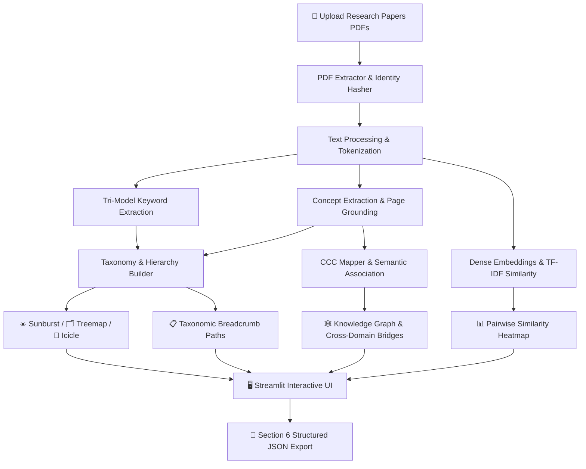

# 🔬 HMRP — Hierarchical Concept Mapping for Research Paper Similarity Analysis

### 🎓 **Marwadi University** · **Department of Information and Communication Technology (ICT)**
#### 📚 **Subject:** Information Retrieval & Natural Language Processing (IRNLP) Research Project

[](https://www.python.org/downloads/)
[](https://streamlit.io)
[](https://opensource.org/licenses/MIT)

**HMRP (Hierarchical Matching & Research Parsing)** is a comprehensive NLP and machine learning platform designed to ingest raw scientific research papers (PDFs), perform **strict zero-leakage paper isolation**, extract multi-faceted metadata and concepts, build **multi-tier concept hierarchies**, construct **Concept-to-Concept (CCC) semantic networks**, compute **dense semantic similarity matrices**, and present all insights through a modern glassmorphic Streamlit dashboard.

---

## ✨ Key Features & Capabilities

| Module | Features & Capabilities |
|---|---|
| **📑 PDF Identity & Isolation** | PyMuPDF & `pdfplumber` extraction · SHA-256 identity hashing · Zero concept leakage across papers · Strict schema validation |
| **🔍 Source Traceability** | Exact sentence evidence extraction · Page number grounding · Concept confidence scoring |
| **🔑 Tri-Model Keywords** | Comparative ranked keywords using **TF-IDF**, **KeyBERT** (Dense embeddings), and **YAKE** (Statistical) + interactive association graph |
| **🌳 Taxonomic Hierarchy** | Multi-tier structured domain taxonomy · **Sunburst**, **Treemap**, and **Icicle** Plotly charts · Filterable concept breadcrumb path list |
| **🕸️ Knowledge Graph** | Interactive network topology (Plotly + PyVis) · Multi-paper shared bridges · Single-paper taxonomic trees · CCC semantic network |
| **📊 Similarity Analysis** | Dual-model similarity matrix (**TF-IDF Cosine** + **Dense Sentence Transformers**) · Heatmap visualizations · Top similar paper pairs |
| **📚 Literature Review** | Consolidated Excel matrix with research gaps, objectives, models, algorithms, datasets, metrics, and quantitative results |
| **💾 Academic Export** | Standardized Section 6 JSON export · Full structured reports · High-res Plotly HTML & image exports |

---

## 🏗️ System Architecture



---

## 📁 Repository Structure

```
IRNLP-Research-Work/
├── app/
│   ├── config.py                 # System configurations, domain taxonomy, thresholds
│   ├── main.py                   # Streamlit glassmorphic web dashboard
│   └── pipeline.py               # End-to-end multi-stage pipeline orchestrator
├── extraction/
│   ├── pdf_extractor.py          # PyMuPDF + pdfplumber document parser
│   ├── text_processor.py         # NLTK cleaner, lemmatizer, and vocabulary tokenizer
│   ├── keyword_extractor.py      # TF-IDF + KeyBERT + YAKE extraction algorithms
│   └── concept_extractor.py      # spaCy NER + technical terminology extractor
├── hierarchy/
│   ├── concept_hierarchy.py      # Multi-tier DAG taxonomy & lineage assignment
│   ├── hierarchy_builder.py      # Domain detection & path generator
│   └── ccc_mapper.py             # Concept-to-Concept & cross-domain semantic mapper
├── similarity/
│   └── similarity_engine.py      # TF-IDF Cosine & Sentence Transformer similarity engine
├── visualization/
│   ├── hierarchy_viz.py          # Plotly Sunburst, Treemap, and Icicle visualizers
│   ├── knowledge_graph.py        # NetworkX, Kamada-Kawai, & PyVis network graphs
│   └── heatmap_viz.py            # Pairwise similarity heatmap charts
├── models/
│   └── paper.py                  # Paper dataclass with Section 6 JSON schema serialisation
├── utils/
│   ├── logger.py                 # Centralized logging utility
│   ├── validator.py              # Data schema and paper integrity validator
│   └── helpers.py                # Text processing & formatting helper functions
├── tests/
│   ├── test_ccc_mapping.py       # Concept-to-Concept & cross-domain tests
│   └── test_dataset_expansion.py # Data pipeline & incremental process tests
├── HMRP_Dataset/                 # Dataset processing scripts & papers dataset
├── data/
│   ├── uploads/                  # PDF paper uploads
│   ├── processed/                # Normalized JSON intermediate representations
│   └── exports/                  # Exported Section 6 JSON files
├── requirements.txt              # Production dependencies
└── run.py                        # Application entry launcher
```

---

## 🚀 Installation & Quick Start

### 1. Clone & Set Up Virtual Environment

```bash
git clone https://github.com/Nikhilbhanderi91/IRNLP-Reserch-Work.git
cd IRNLP-Reserch-Work

# Create virtual environment
python3 -m venv venv
source venv/bin/activate       # macOS / Linux
# OR: venv\Scripts\activate    # Windows
```

### 2. Install Dependencies

```bash
pip install -r requirements.txt
```

### 3. Download NLP Language Model

```bash
python3 -m spacy download en_core_web_sm
```

### 4. Launch the Web Dashboard

```bash
streamlit run app/main.py
```

Open your browser at **http://localhost:8501**

---

## 🖥️ Using the Dashboard

1. **Upload Papers**: Use the left sidebar to drag & drop one or more PDF research papers.
2. **Select Parameters**: Choose your preferred similarity algorithm (`combined`, `tfidf`, or `semantic`) and keyword top-N limits.
3. **Execute Analysis**: Click **🚀 Analyse Papers**.
4. **Explore the 8 Core Modules**:
   - **📄 Overview**: Inspect extracted metadata, research problem, objective, proposed methods, datasets, models, metrics, and quantitative results.
   - **🔍 Concept Traceability**: View grounded sentence citations with exact page numbers and confidence scores.
   - **🔑 Keywords**: Inspect side-by-side comparative extraction tables and the **Keyword Semantic & Co-occurrence Network Graph**.
   - **🌳 Hierarchy**: Navigate concept parent-child relationships via **Sunburst**, **Treemap**, **Icicle**, and search-filtered **Path Lists**.
   - **🕸️ Knowledge Graph**: Analyze cross-paper bridges, single-paper hierarchies, and **Concept-to-Concept (CCC)** semantic networks.
   - **📊 Similarity**: Examine pairwise heatmaps and ranked top similar paper pairs.
   - **📚 Literature Review**: Review the consolidated matrix comparing research papers across objectives and metrics.
   - **💾 Export & JSON**: Preview and download academic-compliant **Section 6 Structured JSON**.

---

## 🧪 Testing

Execute the automated test suite with pytest:

```bash
pytest
```

---

## ⚙️ Configuration & Customization

Modify [`app/config.py`](file:///Users/nikhilbhanderi/Documents/Reserch%20Work/Reserch%20Project/app/config.py) to customize:
- `DOMAIN_TAXONOMY`: Extend domain seed keywords for automatic classification.
- `SENTENCE_MODEL`: Swap dense embedding models (defaults to `all-MiniLM-L6-v2`).
- `KEYWORD_TOP_N`: Configure top keyword limits and n-gram ranges.
- `COLOR_PALETTE`: Customize UI theme and graph node colors.

---

## 📜 License

This project is licensed under the MIT License — see the [LICENSE](LICENSE) file for details.
